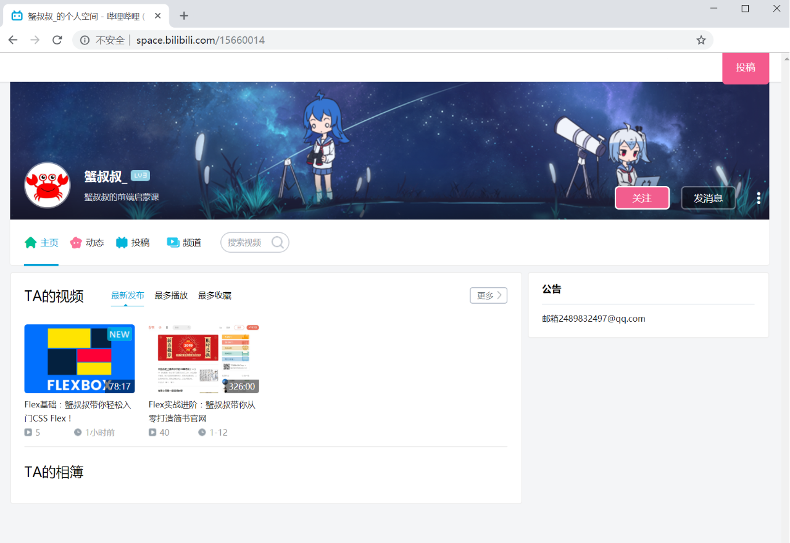

# 蟹叔叔的前端启蒙课

* 本项目为蟹叔叔教学视频的所有代码，喜欢请给个星星哦
* 视频地址：[http://space.bilibili.com/15660014](http://space.bilibili.com/15660014)

### 课程目录 ###
* lesson1: promise和async+await
* lesson2: Flex系列
* lesson3: 双向数据绑定系列
* lesson4: Grid系列
* lesson5: 正则表达式
